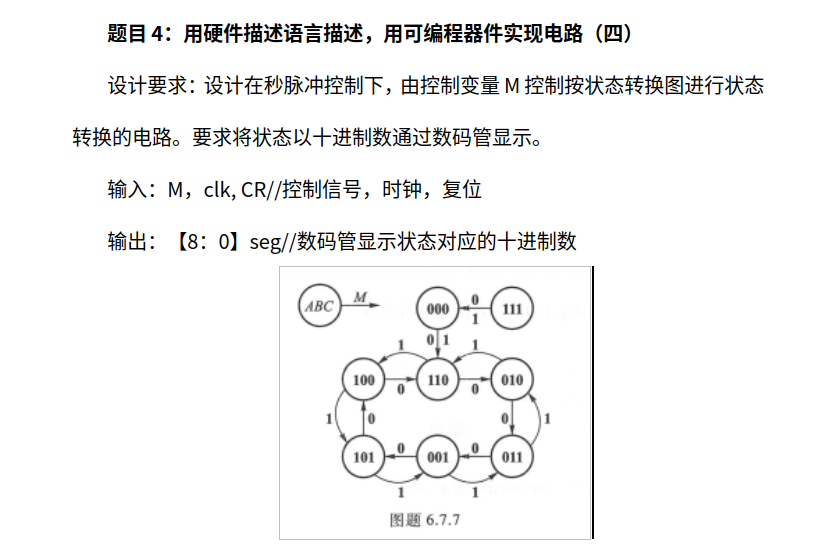
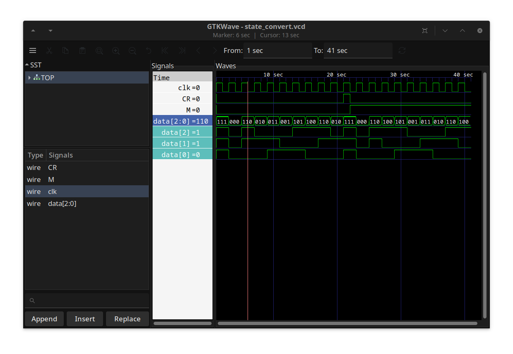
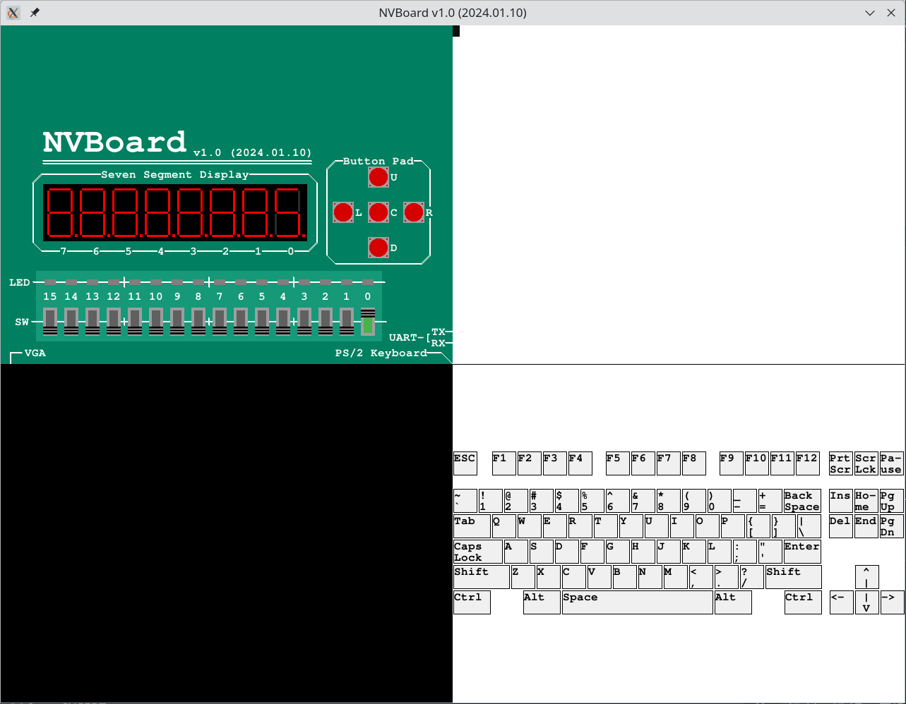

# 数电课程设计 - 一个状态机

*2024 spring, zhaocake*

因为比较好玩，希望能够在完成基础任务的基础上再进行一些设想中的扩展任务。

## [基础任务](./base-task)

在这一部分中我想达成的效果是完完全全不加拓展的报告中所要求的内容，但是我希望能够使用不同的语言来完成这一部分功能。

首先，我展示老师所要求的我们小组所分配到的题目。



分析可以得知，这其实就是写一个状态机。状态机也是fpga设计中的常用思想。除了状态机，还需要一个三到七的译码器用于数码管的显示。

### 使用verilog HDL语言完成上述功能

#### [使用verilator仿真](./base-task/verilog-implement/verilator_impl/)

观察写的模块是否能完成基础功能，结果是能。



点击小标题可达文件夹。需要安装verilator和gtkwave方可编译与显示。编译结果已删除，但保留了vcd波形文件可使用gtkwave查看。

#### [使用南大nvboard虚拟fpga](./base-task/verilog-implement/nvboard_impl/)

南大nvboard链接：[github:NJU-ProjectN/nvboard](https://github.com/NJU-ProjectN/nvboard)

关于nvboard的使用按下不表，他们的文档写得已经比较详细，源码量也不大，可以阅读理解功能。

相比于verilator的仿真，主要添加的功能是用于数码管的3-7译码器模块以及状态转换模块中的计时器。

由于nvboard实际上依然没有晶振，所以采取了在single_cycle里加入延时的方案模拟了500hz的频率。

```cpp
static void single_cycle() {
  dut.clk = 0; dut.eval();
  std::this_thread::sleep_for(std::chrono::milliseconds(1)); 
  dut.clk = 1; dut.eval();
  std::this_thread::sleep_for(std::chrono::milliseconds(1)); // 2ms per cycle, 500Hz
}
```

这种方法还是会和计算机本机时间有延迟，感兴趣的话你可以考虑获取当前计算机时间做个对齐。

下面是视频演示，若视频无法打开，则视频在`docs/images/屏幕录像 2024-06-06 17:22:28.webm`

<video controls>
    <source src="./docs/images/屏幕录像 2024-06-06 17:22:28.webm" type="video/webm">
</video>



#### [Quartus上跑](./base-task/verilog-implement/intel_fpga/)

相比于nvboard，仅仅改一下计时器就可以了，使用的开发板是学校的小脚丫fpga， max10m02sc153c8g。有一说一，有点古了，只有2k资源，估计想跑个arm m0都跑不上。

除了计时器，还需要加上数码管的使能位。虚拟板子上面没有这个使能位。

图后面队友下载了补。

### [Chisel HDL语言实现上述功能](./base-task/chisel-implement/)

已实现。未编写测试代码

## [扩展功能](./extends-task/)

emmm，想跑个arm核或者risc-v核，那么小脚丫多半是不够用了；不过我自己还有一个高云芯片的板子，有20k lut。

### [简单功能扩展](./extends-task/simple_extends/)

因为多半要要求一定要在那个只有2k资源的板子上跑起来，我是很无语言的。要求做一个状态机我也不知道能整出什么花样来，我也不敢擅自把板子的排针焊上去，等于说外设都加不了。

1. 切换手动出发与定时触发模式，拨动开关实现。
2. 第二个数码管显示定时触发模式下状态切换的频率，共0到7挡，为零时表示停止切换。

### [跑一个Cortex-M0内核实现该任务](./extends-task/cm0_core/)

首先尝试在arm的designstart开源的cm0的基础上通过cmsdk来实现一个arm的内核。

TODO

### [跑一个RISC-V内核实现该任务](./extends-task/riscv_core/)

TODO
