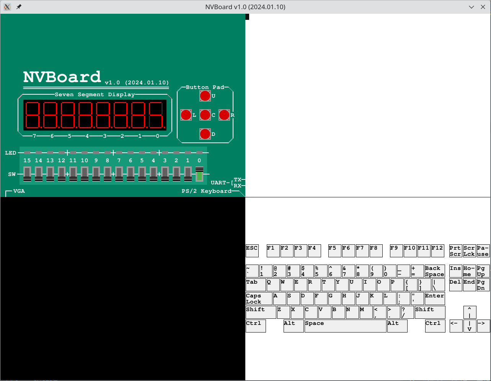
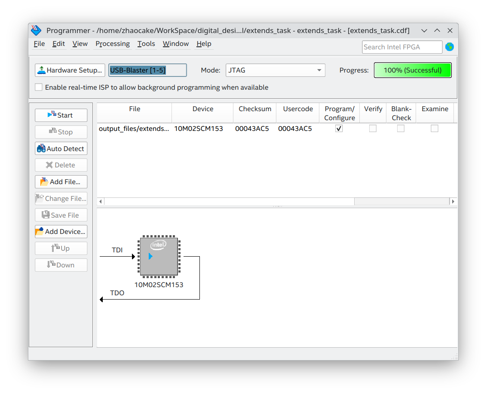

<!-- 不过是老师的任务罢了 -->
# 设计题目

原文

# 设计要求

原文

# 设计思路

分析可知，题目要求实现一个状态转换电路，并且需要将状态通过数码管显示，因此设计主要可以分为两个模块：

- 状态转换器的模块：实现状态转换的逻辑
    - 定时器：实现题目要求中的秒脉冲控制
    - 状态转换：M分别为0与1时的状态转换
- 数码管显示模块：一个3到7的译码器，输入状态的二进制数，输出能得到要求中数字的7位作用于数码管的输出

对于基础功能的实现，上面的设计已经足够。为了更加锻炼能力，小组讨论打算实现的扩展功能如下：

1. 通过拨动开关实现切换手动与定时触发模式；
2. 通过一个指示灯指示当前采用的模式；
3. 通过一个轻触开关实现触发手动信号；
4. 通过两个轻触开关实现自动模式下的加快与减慢计数，共0到15挡，每个档位频率翻倍，为零时表示停止切换；
5. 通过第二个数码管显示当前的状态变换频率；
6. 通过三个led展示当前状态的二进制表示。

要实现上述扩展功能，除了增加输出引脚外，在设计方面主要有三处变化：

1. 分频器的改变：由于需要改变状态转换的频率，因此在处理时需要改变原本的1s（12Mhz）一次变化的频率，通过如下的方式来实现：
```verilog
reg [23:0] clock;

parameter [23:0] ONE_SECOND = 24'd12000000;

always @(posedge clk) begin
    // 根据speed的值，设置CLOCK的值
    case (speed)
        4'b0000: clock = 24'd0;
        4'b0001: clock = ONE_SECOND;
        4'b0010: clock = ONE_SECOND / 2;
        4'b0011: clock = ONE_SECOND / 3;
        4'b0100: clock = ONE_SECOND / 4;
        4'b0101: clock = ONE_SECOND / 5;
        4'b0110: clock = ONE_SECOND / 6;
        4'b0111: clock = ONE_SECOND / 7;
        4'b1000: clock = ONE_SECOND / 8;
        4'b1001: clock = ONE_SECOND / 9;
        4'b1010: clock = ONE_SECOND / 10;
        4'b1011: clock = ONE_SECOND / 11;
        4'b1100: clock = ONE_SECOND / 12;
        4'b1101: clock = ONE_SECOND / 13;
        4'b1110: clock = ONE_SECOND / 14;
        4'b1111: clock = ONE_SECOND / 15;
    endcase 
end
```
2. 按键触发的实现：为了实现按键检测，我们存储每个周期的当前按键的电平情况，如果电平发生了变化，则说明出现按下或松开。通过对电平的判断还可以确认是按下还是松开。在本设计中。仅考虑了按键按下。
```verilog
always @(posedge clk) begin
    last_trigger <= trigger;
end
// ...
if (trigger && !last_trigger) begin
    signal <= 1;
end 
```
3. 数码管模块改写：由于需要实现16个档位的速度变化，所以要展示速度变化情况的话，就需要一个4到7的译码器，也就是说数码管模块的输入应该变为四位的。在这种情况下，在实例化状态变量显示数码管的时候，需要在最高位添加一位0；
```verilog
bit_4_to_seg7 bit_3_to_seg7_inst (
  .binary_in({1'b0, state}),
  .seg7_out(seg7_out)
);
```
其余的变化则主要是完善逻辑。

# 小组分工

略

# Verilog源程序

```verilog
// top.v
module check_clock(
  input clk,
  output reg clk_led
);
parameter [23:0] ONE_SECOND = 24'd12000000;

reg [23:0] timer;

always @(posedge clk) begin
  if (timer == ONE_SECOND - 1) begin
    timer <= 0;
    clk_led <= ~clk_led;
  end else begin
    timer <= timer + 1;
  end
end

endmodule


module top (
  input clk,  // 时钟信号
  input rst,  // 复位信号
  input M,  // 模式选择信号
  input mode, // 切换手动/自动模式
  input trig, // 触发信号 
  input spd_up, 
  input spd_down,
  output wire [6:0] seg7_out,    // 7段数码管输出
  output wire [6:0] speed_disp,  // 速度显示
  output reg mode_led,
  output [1:0] seg_en,
  output [2:0] state_led,
  output [5:0] btn_led, // 
  output wire clk_led
);

wire [2:0] state;  // 状态
reg [3:0] speed;  // 速度

reg last_spd_up;
reg last_spd_down;

assign state_led = ~state;
assign seg_en = 2'b00;
assign btn_led = {M, mode, rst, spd_down, spd_up, trig};

always @(posedge clk) begin
  last_spd_up <= spd_up;
  last_spd_down <= spd_down;
end

always @(posedge clk or negedge rst) begin
  if (!rst) begin
    speed <= 4'b0001;
  end else if (!mode) begin
    mode_led <= 0;
    if (spd_up && !last_spd_up) begin
      speed <= speed + 1;
    end else if (spd_down && !last_spd_down) begin
      speed <= speed - 1;
    end
  end else if (mode) begin 
    mode_led <= 1;
  end
end

// 状态转换模块
state_convert state_convert_inst (
  .clk(clk),
  .CR(rst),
  .M(M),
  .mode(mode),
  .trigger(trig),
  .speed(speed),
  .data(state)
);

// 3位二进制数到7段数码管模块
bit_4_to_seg7 bit_3_to_seg7_inst (
  .binary_in({1'b0, state}),
  .seg7_out(seg7_out)
);

// 3位二进制数到速度显示模块
bit_4_to_seg7 speed_disp_inst (
  .binary_in(speed),
  .seg7_out(speed_disp)
);

check_clock check_clock_inst (
  .clk(clk),
  .clk_led(clk_led)
);

endmodule

```

```verilog
// state_convert.v
module state_convert (
  input clk,
  input CR,
  input M,
  input mode,
  input trigger,
  input [3:0] speed,

  output reg [2:0] data
);

reg [23:0] clock;

parameter [23:0] ONE_SECOND = 24'd12000000;

always @(posedge clk) begin
    // 根据speed的值，设置CLOCK的值
    case (speed)
        4'b0000: clock = 24'd0;
        4'b0001: clock = ONE_SECOND;
        4'b0010: clock = ONE_SECOND / 2;
        4'b0011: clock = ONE_SECOND / 3;
        4'b0100: clock = ONE_SECOND / 4;
        4'b0101: clock = ONE_SECOND / 5;
        4'b0110: clock = ONE_SECOND / 6;
        4'b0111: clock = ONE_SECOND / 7;
        4'b1000: clock = ONE_SECOND / 8;
        4'b1001: clock = ONE_SECOND / 9;
        4'b1010: clock = ONE_SECOND / 10;
        4'b1011: clock = ONE_SECOND / 11;
        4'b1100: clock = ONE_SECOND / 12;
        4'b1101: clock = ONE_SECOND / 13;
        4'b1110: clock = ONE_SECOND / 14;
        4'b1111: clock = ONE_SECOND / 15;
    endcase 
end

reg [23:0] timer;
reg signal;
reg last_trigger;

always @(posedge clk) begin
    last_trigger <= trigger;
end

always @(posedge clk or negedge CR) begin
    if (!CR) begin
        timer <= 0;
        signal <= 0;
    end else if (!mode && !(clock==0)) begin  // 自动模式
        if (timer >= clock - 1) begin
            timer <= 0;
            signal <= 1; 
        end else begin
            timer <= timer + 1;
            signal <= 0;
        end 
    end else if (mode) begin  // 手动模式
        if (trigger && !last_trigger) begin
            signal <= 1;
        end else begin
            signal <= 0;
        end
    end
end

always @(negedge CR or posedge signal) begin 
    if (!CR) begin
        data <= 3'b111;
    end else begin
        if (M == 1) begin
            case (data)
                3'b000: data <= 3'b110;
                3'b001: data <= 3'b011;
                3'b010: data <= 3'b110;
                3'b011: data <= 3'b010;
                3'b100: data <= 3'b101;
                3'b101: data <= 3'b001;
                3'b110: data <= 3'b100;
                3'b111: data <= 3'b000;
            endcase
        end else if (M == 0) begin
            case (data)
                3'b000: data <= 3'b110;
                3'b001: data <= 3'b101;
                3'b010: data <= 3'b011;
                3'b011: data <= 3'b001;
                3'b100: data <= 3'b110;
                3'b101: data <= 3'b100;
                3'b110: data <= 3'b010;
                3'b111: data <= 3'b000;
            endcase
        end
    end
end

endmodule
```

```verilog
// bit4_to_seg7.v
module bit_4_to_seg7 (
	input [3:0] binary_in,  // 3位二进制输入
	output reg [6:0] seg7_out    // 7段数码管输出
);

always @(*) begin
	// 根据输入的3位二进制数设置7段数码管输出
	case (binary_in)
		4'b0000: seg7_out = ~7'b1000000;  // 0
		4'b0001: seg7_out = ~7'b1111001;  // 1
		4'b0010: seg7_out = ~7'b0100100;  // 2
		4'b0011: seg7_out = ~7'b0110000;  // 3
		4'b0100: seg7_out = ~7'b0011001;  // 4
		4'b0101: seg7_out = ~7'b0010010;  // 5
		4'b0110: seg7_out = ~7'b0000010;  // 6
		4'b0111: seg7_out = ~7'b1111000;  // 7
		4'b1000: seg7_out = ~7'b0000000;  // 8
		4'b1001: seg7_out = ~7'b0010000;  // 9
		4'b1010: seg7_out = ~7'b0001000;  // A
		4'b1011: seg7_out = ~7'b0000011;  // B
		4'b1100: seg7_out = ~7'b1000110;  // C
		4'b1101: seg7_out = ~7'b0100001;  // D
		4'b1110: seg7_out = ~7'b0000110;  // E
		4'b1111: seg7_out = ~7'b0001110;  // F
	endcase
end

endmodule
```

# 调试过程

## 仿真调试

### 1.verilator仿真得到的基础功能波形图


### 2.verilator仿真及nvboard基础功能效果



## 真机调试

### 1.分析和综合

### 2.管脚分配


### 3.编译


### 4.编程器下载


# 设计结果展示、分析

## 1.基本功能完成情况

我操。写啥呀。

## 2. 扩展功能完成情况

我操，问就是都做了呀。

# 心得体会

在本次数电课程设计过程中，我们团队齐心协力，共同完成了实验部分，并取得了显著成果。回顾这一过程，我们总结了一些经验和心得，愿在此与大家分享。

首先，使用FPGA进行数字电路设计时，我们注意到不同板子之间的差异。以我们使用的“小脚丫STEP”板卡为例，它搭载了MAX10芯片，拥有2k的逻辑资源，在设计过程中，我们充分考虑了板卡的硬件资源，力求在有限资源下实现最佳性能。

其次，我们认识到仿真与实际之间的区别。在实验过程中，我们发现仿真结果与实际硬件测试之间存在一定差距。因此，在完成仿真后，我们进行了充分的实际硬件测试，以确保设计的正确性和稳定性。

再次，我们将课内所学知识应用于实践。本次实验涉及数字电路、数字信号处理、计算机组成原理等多个方面的知识。在实验过程中，我们成功地将这些知识应用于实际设计，实现了预期目标。

此外，我们注重模块复用和低耦合。在数字电路设计中，模块化设计有助于降低复杂性，提高代码的可读性和可维护性。同时，低耦合减少了模块之间的相互影响，使各个模块更加独立，便于修改和维护。

本次数电课程设计让我们团队收获颇丰。我们深刻体会到了理论知识与实际操作相结合的重要性，同时也认识到了自己在某些方面的不足。在今后的学习和工作中，我们将继续努力，不断提高自己的专业素养，为我国的数字电路设计领域贡献自己的一份力量。


